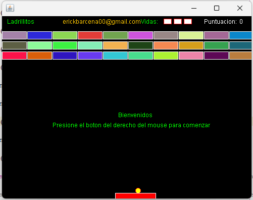

# Arkanoid Game in Java

A classic **Arkanoid** (brick-breaker) game developed in Java. The player controls a paddle to bounce a ball and break bricks. The game offers multiple levels, power-ups, and challenging gameplay.



## Table of Contents
- [Features](#features)
- [Installation](#installation)
- [How to Play](#how-to-play)
- [Controls](#controls)
- [Game Mechanics](#game-mechanics)
- [Contribution](#contribution)
- [License](#license)

## Features
- Multiple levels with increasing difficulty
- Power-ups (extend paddle, extra balls, etc.)
- Realistic ball physics
- Sound effects and background music
- Score tracking and lives system
- Pause and resume functionality
- Customizable gameplay settings

## Installation

1. Clone the repository:
   ```bash
   git clone https://github.com/your-username/java-arkanoid-game.git
